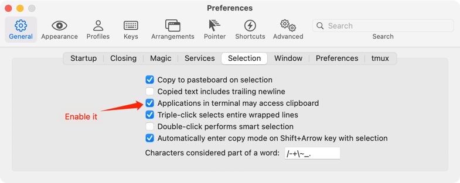

# remote pbcopy for use over ssh

`pbcopy` is a well-known macOS tool that copies data to the clipboard.
It's very useful, but available only in your local machine, not in remote machines.

Fortunately, with OSC52 escape sequence,
we can access the local machine clipboard via a remote machine.

I prepared a simple tool that is `rpbcopy` for remote machines.

## Build & Install
It requires requires `rust` installed to build `rpbcopy`. 
Installing `rpbcopy` is just copy the built artifact to `$PATH`.

       [local]  $ ssh user@remote.host
       [remote] $ git clone https://github.com/expnn/rpbcopy.git
       [remote] $ cd rpbcopy 
       [remote] $ cargo build --release 
       [remote] $ cp target/release/rpbcopy /path/to/bin/

### iTerm2

Features required are not enabled by default

1. First, make sure you use iTerm2 version 3.0.0 or later
2. Check "Applications in terminal may access clipboard" in iTerm2 Preferences:

    

### Ghostty

Ghostty supports OSC52 natively. No additional configuration is needed.

If you want to control clipboard permissions, add these to your `~/.config/ghostty/config`:

```ini
clipboard-read = allow
clipboard-write = allow
```

### tmux

If you're using `rpbcopy` inside a `tmux` session, you need to enable OSC52 support.

Add this to your `~/.tmux.conf`:

```tmux
set -g set-clipboard on
```

Then reload your tmux configuration:

```bash
tmux source-file ~/.tmux.conf
```

Or restart tmux to apply the changes.

## Usage

Just like the normal `pbcopy`:

    [local]  $ user@remote.host
    [remote] $ date | rpbcopy
    [remote] $ exit
    [local]  $ pbpaste
    Mon Mar 21 22:15:29 CST 2022

## How about `pbpaste`?

Currently most terminals do not allow OSC 52 read access for security reasons.
But we can just use command+V key to paste content from clipboard.

If you want to save the content of clipboard to a remote file, try this:

    [remote] cat > out.txt
    # press command+V to paste content of clipboard,
    # and press control+D which indicats EOF

## Tested with

* [iTerm2](https://iterm2.com/)
* [Ghostty](https://ghostty.org/)
* tmux 3.3a with Ghostty

## See also

For OSC52

* http://doda.b.sourceforge.jp/2011/12/15/tmux-set-clipboard/
* http://qiita.com/kefir_/items/1f635fe66b778932e278
* http://qiita.com/kefir_/items/515ed5264fce40dec522
* https://chromium.googlesource.com/apps/libapps/+/HEAD/hterm/etc/osc52.vim
* https://chromium.googlesource.com/apps/libapps/+/HEAD/hterm/etc/osc52.el
* https://chromium.googlesource.com/apps/libapps/+/HEAD/hterm/etc/osc52.sh
* https://invisible-island.net/xterm/ctlseqs/ctlseqs.html#h2-Operating-System-Commands
* https://github.com/fcpg/vim-osc52

## License

MIT